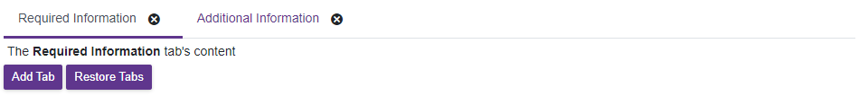

<!-- default badges list -->

<!-- default badges end -->
# Blazor Tabs - Add the Close Tab Button

You can implement a button that closes a tab. 

Specify the [text template](https://docs.devexpress.com/Blazor/DevExpress.Blazor.Base.DxTabBase.TextTemplate) that contains a button. Handle the button's click event to modify a tab model. The [DxTabs](https://docs.devexpress.com/Blazor/DevExpress.Blazor.DxTabs) component updates its tabs after the model changes.

## Files to Look At

- [Index.razor](./CS/DynamicTabs/Pages/Index.razor)

## Documentation

- [TextTemplate](https://docs.devexpress.com/Blazor/DevExpress.Blazor.Base.DxTabBase.TextTemplate)
